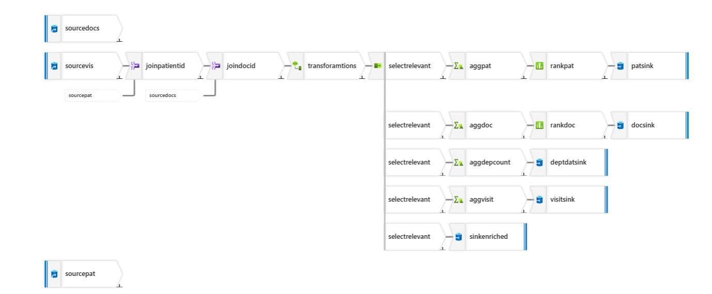

# Clinic data ETL Pipelines – Azure Data Factory

This learning project demonstrates two approaches (batch and per-file) to build an end-to-end ETL pipeline in **Azure Data Factory (ADF)**.
The pipelines automate file ingestion, filtering, transformation, enrichment, and output generation from **Azure Data Lake** folders using dynamic parameterization and **Mapping Data Flows**.

## **Project Objective**
- Automate ingestion of patients.csv, doctors.csv, and visits.csv from a raw data folder.
- Filter only valid files (e.g., starting with patients, doctors, visits).
- Apply data cleaning and transformations such as:
    - Standardizing dates (visit_date).
    - Cleaning missing values and invalid entries in diagnosis and charges.
    - Joining visits with patients and doctors for enriched data.
    - Generating metrics (aggregations, top N doctors, patient summary, docotr summary etc).
- Store the final outputs in Azure Data Lake Gen2 under **cleaned/**, **enriched/**, and **metrics/** folders.

## **Architecture**
- Architecture Diagram -> 

# Pipeline 1: Cleaning Pipeline**
### **Overview**
- Reads all CSV files (patients, doctors, visits) from raw folder.
- Cleans each file by applying:
    - Standardized the diagnosis column by replacing NULL, blanks, or 'N/A' with Not Diagnosed.
    - Created a high_cost_flag column indicating whether treatment cost exceeds 1000.
- Writes cleaned outputs to cleaned folder (e.g., visits_YYYY-MM-DD_cleaned.csv).
  Pipeline execution -> 

### **Pipeline Flow with Screenshots**
1. **Get Metadata:** List all files in Folder 'raw' (`childItems`). --  
2. **Copy** Doctor's file parallely and **Set Variable** activity also executed. 
3. **ForEach:** Iterate over each file name.
4. **If Condition:** `if file is 22nd dated`. --  
5. **Execute Child Pipeline** 
6. **If Condition** : Checks if file is 'patients' or 'visits'. 
7. **Data Flow:** Processes files based on whether it is 'patients' file or 'visits' file. 
     
     
8. **Sink:** Write a cleaned output file to 'cleaned' folder. 

# **Pipeline 2: Enrichment Pipeline**
### **Overview**
- Takes patients_cleaned.csv, doctors_cleaned.csv, and visits_cleaned.csv as input.
- Performs various cleaning, metrics & aggregations:
    - Classified patients by age groups: Child (<18), Adult (18-60), Senior (>60).
    - Converted treatment_cost into a numeric format by removing invalid characters.
    - Classified doctors by experience level: Junior (<5 years), Mid-Level (5-15 years), Senior (>15 years).
    - Selected only relevant columns required for analytics and reporting.
    - Count of visits per department (monthly/overall).
    - Average treatment cost per department.
    - Top 3 doctors by number of visits.
- Separate Output files.

### **Pipeline Flow with Screenshots**
1. **Get Metadata**: List all files in the 'cleaned' folder. 
2. **Filter**: Multiple filters to check which file it is. 
3. **Set Variable**: Sets file name to variable for later use in pipeline. 
5. **Data Flow** -- 
6. **Join and Transform** the file dynamically using pipeline variable. 
7. **Apply transformations** (Select, Aggregate, Rank etc). 
8. **Sink**: Write the cleaned file into the 'enriched' folder with a name like replace(item().name, '.csv', '_cleaned.csv').
    

### **Triggers**
- **Event Trigger:** 

### **Learnings**
- Using Get Metadata + ForEach + If Condition for file-wise dynamic processing.
- Building modular pipelines (main → child → enrichment).
- Data Flow transformations: Derived Column, Join, Aggregate, Rank.
- Dynamic file handling with parameterized datasets and sinks.
- Trigger strategies 

